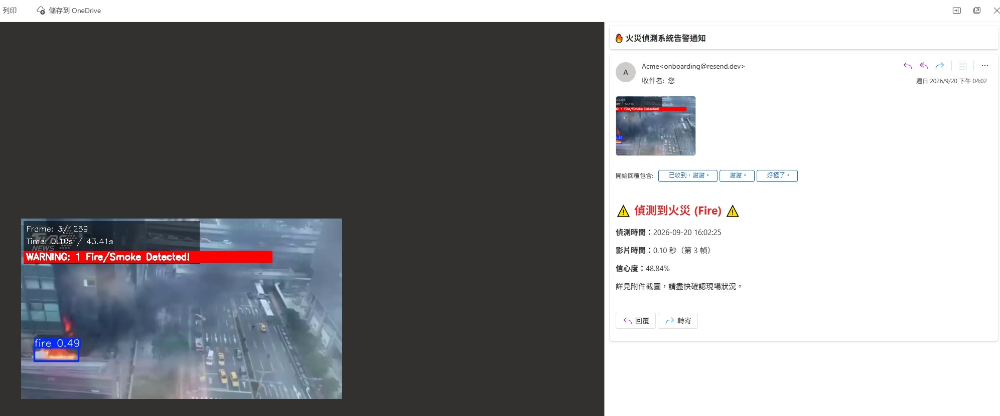

# 🔥 火災 / 煙霧即時辨識系統

用 YOLOv8 對影片進行即時物件偵測，辨識畫面中的火災 (fire) 與煙霧 (smoke)；
一旦偵測到火災，系統會自動擷取當下畫面，並透過 Email 寄出含截圖附件的告警通知。

**🔗 線上Demo：[點我試用](https://firedetectionsystem-fbcfhg6zyrzngpqiqkskys.streamlit.app/)



---

## 這個專案在做什麼

多數監控系統只能「錄下來事後看」，這個專案的重點是**即時反應**：從畫面辨識到通知，全程自動化，不需要人在螢幕前盯著看。

1. 逐幀讀取影片畫面，用YOLOv8模型做物件偵測
2. 偵測到 `fire` 類別時，立即擷取該幀畫面存成截圖
3. 透過 Resend Email API 寄出告警信，附上截圖與偵測時間、信心度等資訊
4. 設有冷卻時間機制，避免火勢持續時被同一事件灌爆信箱

## 功能特色

- **即時物件偵測**：YOLOv8自訓練火災/煙霧辨識模型，逐幀分析並標註偵測框
- **自動告警**：偵測到火災時觸發Email通知，信件內含現場截圖、偵測時間、信心度
- **告警冷卻機制**：60秒內同一事件只寄一次信，避免告警信氾濫
- **偵測日誌**：每筆偵測結果（類別、信心度、座標、時間）皆記錄成CSV，可下載留存
- **可互動線上Demo**：直接在瀏覽器測試，也支援上傳自己的影片檔查看辨識效果

## 技術架構

| 項目 | 技術 |
|---|---|
| 物件偵測 | YOLOv8（Ultralytics） |
| 影像處理 | OpenCV |
| Email告警 | Resend API |
| 網頁介面 | Streamlit |
| 部署 | Streamlit Community Cloud |

## 本機執行

```bash
git clone <此repo的網址>
cd fire_detection_streamlit
pip install -r requirements.txt
streamlit run app.py
```

啟動後瀏覽器會自動開啟本機網頁，選擇示範影片即可看到即時辨識效果。
若要體驗完整的Email告警功能，需自行申請 [Resend](https://resend.com) API Key，
並在 `.streamlit/secrets.toml` 中設定（可參考 `secrets.toml.example`）。

## 延伸版本：USB攝影機即時監控

除了這個網頁demo版本，本專案也已開發一個**本機版本**，改用USB攝影機做真正的即時串流監控
（而非讀取影片檔），更貼近實際的現場監控情境：

- **Tkinter桌面UI**：單一視窗整合即時畫面、狀態列與系統日誌，不需要在多個終端機視窗間切換，開啟後即可直接監看攝影機畫面
- **多管道告警通知**：偵測到火災時，除了原本的Email告警（含截圖附件），同步串接 **LINE Bot** 推播通知，訊息可即時傳送到手機，不需要開著信箱才會看到
- **系統警告音**：偵測到火災的當下，電腦會發出警告音效，即使沒有盯著螢幕，也能透過聲音立即察覺異常
- **偵測日誌輸出**：同樣會將每筆偵測結果（類別、信心度、座標、時間）即時寫入 `log.csv`，方便事後追溯與統計

這個版本因需要實體攝影機，不適合公開部署上線，因此這次線上Demo只提供影片辨識版本。
本機版程式碼與示範影片未包含在這次部署的repo中，如需完整程式碼歡迎另外聯繫索取。

## 關於作者

如果你在找電腦視覺 / AI應用相關的開發者，歡迎與我聯繫聊聊。
e-mail:gn02908107@gmail.com
